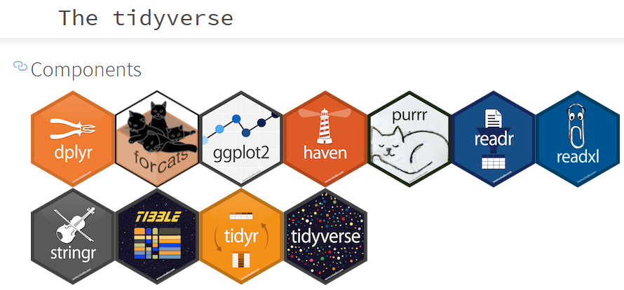

```{r setup, include=FALSE}
knitr::opts_chunk$set(echo = FALSE)
```

## What is data munging?

Data munging or data wrangling: 

- from raw data to cleaned data
- from experiment to statistical result

Can involve:

- reading from data bases, text files, websites and combining multiple sources
- enriching data 
- error correction
- cleaning
- seperating variables
- recoding


## Common problems

**How projects go sideways in a standard statistics course:**

- inability to scrape data off the web, 
- get data from an API
- parse JSON or XML file 
- utter defeat by date times 
- text encoding fiascos
- ineptitude with regular expressions
- R scripts that consume infinite time, ram
- software installations going wrong  

from https://speakerdeck.com/jennybc/teach-data-science-and-they-will-come


## Inability to work with messy or uncleaned data

Other problems:

- Column headers are values, not variable names:  `<$10k` `$10-20k` `$20-30k` `$30-40k` `$40-50k`
- Multiple variables are stored in one column: `year   m04  m514  m014 m1524 m2534 m3544 m4554 m5564`
- Variables are stored in both rows and columns `row 1 mean, row 2 sum`
- Multiple types of observational units are stored in the same table
- A single observational unit is stored in multiple tables.

<http://tidyr.tidyverse.org/articles/tidy-data.html>

## Change of focus in coursework? {.flexbox .vcenter}

Should we focus more tidying data and data wrangling?

You can't do analysis when you can't use, or load the data.


## Data Transforming {.flexbox .vcenter}

Very uncomfortable for students, so much that we often just do 
it for them. 


## Tidy data:

0. *rectangle your data*.
1. Each variable must have its own column.
2. Each observation must have its own row.
3. Each value must have its own cell.


## Tidyverse




# Pipes

## A poem {.flexbox .vcenter}
```
  " Little bunny, Foo Foo
  Hopping through the forest
  Scooping up the field mice
  And bopping them on the head"
```

## base R version {.flexbox .vcenter}

```
foo_foo <- little_bunny()
bop_on( scoop_up( hop_through(foo_foo, forest), field_mouse ), head )
```

OR

```
foo_foo <- little_bunny()
hopped <- hop_through(foo_foo, forest)
scooped <- scoop_up( hopped, field_mouse )
result <- pop_on(scooped, head)
result

```


## Pipe version {.flexbox .vcenter}

```
foo_foo <- little_bunny()
foo_foo %>%
  hop(through = forest) %>%
  scoop(up = field_mouse) %>%
  bop(on = head)
```

# Demonstration!


## Conclusion

- if possible, make rectangular 'tidy' data
- use pipes to make a sequence of steps
- keep within the tidyverse


## Final Thoughts

*Replace data-scientist with statistician*

"Yet far too much handcrafted work — what data scientists call “data wrangling,” “data munging” and “data janitor work” — is still required. Data scientists, according to interviews and expert estimates, spend from 50 percent to 80 percent of their time mired in this more mundane labor of collecting and preparing unruly digital data, before it can be explored for useful nuggets."

[NY times 2014-08-18](https://www.nytimes.com/2014/08/18/technology/for-big-data-scientists-hurdle-to-insights-is-janitor-work.html)

Most master students will work as statisticians / data scientists in
industry. Where data cleaning is 80% of the work. 


Find this presentation on github at <https://github.com/rmhogervorst/datawrangling> *look at Tijn's face now*

## Links

[STAT545 course online](<http://stat545.com/ "great resource, entire undergrad course data munging by Jenny Bryan")

[wikipedia page about data wrangling](https://en.wikipedia.org/wiki/Data_wrangling)

[video about putting lists and other types of data into a data-frame - Jenny Bryan](https://www.youtube.com/watch?v=GapSskrtUzU&index "Jenny Bryan Data rectangling")
[slides from that presentation here](https://speakerdeck.com/jennybc/data-rectangling)

[Book: Hadley Wickham's R 4 data science (online)](http://r4ds.had.co.nz/)

[Chapter from that book about tidy data](http://r4ds.had.co.nz/tidy-data.html "chapter about tidy data")

[Tidy data - Wickham 2013](http://dx.doi.org/10.18637/jss.v059.i10)

[code-heavy explanation of tidy data article](http://tidyr.tidyverse.org/articles/tidy-data.html)
